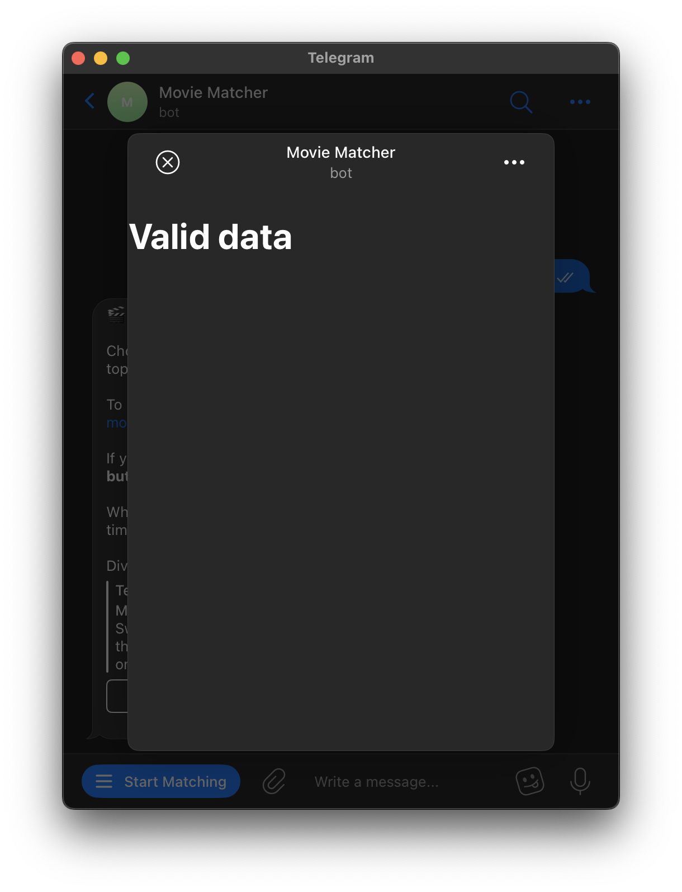

<div align="center">


<h1>Telegram Movie Matcher App</h1>

🎬 **Welcome to Movie Matcher!** 🎥

Choose your genres and years, and **swipe through** our top movie picks.

To match with **friends** share the app link - [t.me/movie_matcher_bot/app](https://t.me/movie_matcher_bot/app).

If you're in the mood for **solo** discovery, use the **menu button**.

When everyone **swipes right** on a movie, it's popcorn time!

Dive in and elevate your movie nights!

[Launch Movie Matcher Bot](https://t.me/movie_matcher_bot) · [Launch Movie Matcher App](https://t.me/movie_matcher_bot/app)

</div>

## Table of Contents

- [Table of Contents](#table-of-contents)
- [Start the app](#start-the-app)
- [Tutorial](#tutorial)
  - [Initialization with Drayman Framework](#initialization-with-drayman-framework)
  - [Installing Necessary Packages](#installing-necessary-packages)
  - [Modifying index.html, adding styles.css and assets](#modifying-indexhtml--adding-stylescss-and-assets)
  - [Retrieving API Tokens](#retrieving-api-tokens)
  - [Setting up ngrok for HTTPS Tunneling](#setting-up-ngrok-for-https-tunneling)
  - [Integrating with Telegram](#integrating-with-telegram)
  - [Adding Telegram Bot API Support](#adding-telegram-bot-api-support)
  - [Defining the Movie Matcher app flow](#defining-the-movie-matcher-app-flow)
  - [Setting up browser commands and events](#setting-up-browser-commands-and-events)
  - [Validating user](#validating-user)
  - [Sticker animation component](#sticker-animation-component)
  - [Setting up server logic](#setting-up-server-logic)
  - [Matching main component to server logic](#matching-main-component-to-server-logic)
  - [Options button component](#options-button-component)
  - [Options menu component](#options-menu-component)
  - [Movie card component](#movie-card-component)
  - [Final look at the main component](#final-look-at-the-main-component)
    - [Setup screen and year/genre selection screens](#setup-screen-and-year-genre-selection-screens)
    - [Matching screen and movie selected screen](#matching-screen-and-movie-selected-screen)
    - [Waiting for others screen](#waiting-for-others-screen)
    - [No movie selected screen](#no-movie-selected-screen)
    - [No movies screen](#no-movies-screen)
    - [Invalid data screen](#invalid-data-screen)
  - [Reacting to viewport height change](#reacting-to-viewport-height-change)
  - [Reacting to theme change](#reacting-to-theme-change)
  - [Multiplayer usage](#multiplayer-usage)
- [Publishing the app](#publishing-the-app)
- [Future improvements](#future-improvements)

## Start the app

If you don't want to go trough the tutorial and create this app from scratch, you can simply start the app by following these steps:

- Clone this repository.
- Install dependencies: `npm install`.
- Follow [Retrieving API Tokens](#retrieving-api-tokens).
- Follow [Setting up ngrok for HTTPS Tunneling](#setting-up-ngrok-for-https-tunneling).
- Follow [Integrating with Telegram](#integrating-with-telegram).
- Start an app, providing required tokens as environment variables:

```bash
MOVIE_DB_API_KEY=<your-movie-db-token> BOT_TOKEN=<your-telegram-token> npm start
```

Make sure that you use your own link to the app in the welcome message in `src/index.ts` file.

## Tutorial

In this tutorial, we'll create a Telegram mini app that will allow users to match with movies. We'll use [Drayman framework](https://www.drayman.io/) to create this app and go trough some major features of Telegram mini apps. You can use first steps from this tutorial as a boilerplate for your own Telegram mini app.

You can find the final code of this app here: [tg-movie-matcher-app](https://github.com/jansivans/tg-movie-matcher-app).

### Initialization with Drayman Framework

Drayman Framework was chosen for the Telegram Mini App development because of its fast setup and unified full-stack development - combining server and client side inside components. It is also very easy to use and has a lot of features that are useful for Telegram Mini Apps.

Let's start by initializing and starting new Drayman project:

```bash
npx @drayman/framework-init@latest tg-movie-matcher-app
cd tg-movie-matcher-app
npm start
```

"Drayman started at http://localhost:3033" text will be printed in the console. Open this URL in your browser and you'll see Drayman welcome page:


### Installing Necessary Packages

Let's install all packages we'll need for this app:

- `telegraf` - Telegram bot API wrapper, we'll use it to work with Telegram API.
- `@lottiefiles/lottie-player` - Lottie animation player, we'll use it to play animated stickers.
- `chroma-js` - color manipulation library, we'll use it to generate correct color for movie rating badge.
- `drayman-swipi-cards` - Drayman component for swiping cards.
- `js-confetti` - confetti animation library, we'll use it to show confetti animation when user matches with a movie.
- `nanoid` - library to generate unique IDs, we'll use it to generate unique IDs for user connections.
- `node-themoviedb` - library to work with [The Movie Database](https://www.themoviedb.org/) API, we'll use it to get movies data.

```bash
npm install telegraf@4.14.0 @lottiefiles/lottie-player@2.0.2 chroma-js@2.4.2 drayman-swipi-cards@2.0.9 js-confetti@0.11.0 nanoid@3.3.4 node-themoviedb@0.2.8 --save-exact
```

### Modifying index.html, adding styles.css and assets

Some packages we've installed require scripts to be added to `index.html` file. Also you'll need to add `telegram-web-app.js` script to enable Telegram mini app mode. Here is the final `index.html` file:

```html
<head>
  <meta charset="utf-8" />
  <meta http-equiv="X-UA-Compatible" content="IE=edge" />
  <title>Movie Matcher Telegram Mini App</title>
  <meta name="viewport" content="width=device-width, initial-scale=1" />
  <script src="https://telegram.org/js/telegram-web-app.js"></script>
  <script src="/drayman-framework-client.js"></script>
  <script src="/node_modules/drayman-swipi-cards/dist/swipi-cards/swipi-cards.js"></script>
  <script src="/node_modules/js-confetti/dist/js-confetti.browser.js"></script>
  <script src="/node_modules/@lottiefiles/lottie-player/dist/lottie-player.js"></script>
  <link rel="stylesheet" href="styles.css" />
</head>
```

As you can see, we've also added `styles.css` file to `index.html`. Don't forget to create this file in `public` folder next to `index.html` file. Copy the code from this link: [styles.css](https://github.com/jansivans/tg-movie-matcher-app/blob/main/public/styles.css) and paste it to your `styles.css` file.

Create `stickers` folder in `public` folder and copy all stickers from this link: [stickers](https://github.com/jansivans/tg-movie-matcher-app/tree/main/public/stickers).

### Retrieving API Tokens

Now let's retrieve required tokens for our app.

- Telegram token - `BOT_TOKEN` - create a new bot using `/newbot` command in [BotFather](https://t.me/botfather) and copy the token.
- The Movie Database API key - `MOVIE_DB_API_KEY` - create a new account on [The Movie Database](https://www.themoviedb.org/) and copy the API key from [API page](https://www.themoviedb.org/settings/api).

### Setting up ngrok for HTTPS Tunneling

One of the Telegram requirements is that web app must be hosted on HTTPS, so we'll use [ngrok](https://ngrok.com/) to create a tunnel to our local server. Install it and after that, I suggest you to create a ngrok account to create a static domain. This way you'll be able to use the same link to your app every time you start it. Here are official instructions on how to do it: [free static domain for all ngrok users](https://ngrok.com/blog-post/free-static-domains-ngrok-users).

After retrieving your domain, start ngrok tunnel:

```bash
ngrok http --domain=[static-domain] 3033
```

In result, you'll see something like this:


### Integrating with Telegram

Copy this HTTPS link and using [BotFather](https://t.me/botfather) create a new app with `/newapp` command. When asked for a link to the app, paste the link you've copied from ngrok. As the short app name, you can simply type `app`. In result, you'll get a link to your app, something like this: `t.me/movie_matcher_test_bot/app`.

We can also add menu button to our bot to launch our app. To do this, go to [BotFather](https://t.me/botfather) and select your bot. Then select `Bot Settings` and then `Menu Button`, `Configure menu button`. Send him a link you got from ngrok. After that, you'll be able to launch your app by clicking on the menu button in your bot. However, we haven't added Telegram bot API support to our app yet, so it won't work. Let's do it now.

### Adding Telegram Bot API Support

Let's integrate Telegram bot API support to our app now. Create a new [Server](https://www.drayman.io/docs/components-in-depth/helpers/the-server-object) `index.ts` file in `src` folder and add the following code to it:

```ts
import { Telegraf } from "telegraf";
import { message } from "telegraf/filters";
import express from "express";
import MovieDB from "node-themoviedb";

export const Server: DraymanServer = async ({ EventHub, app }) => {
  app.use("/node_modules", (req, res, next) =>
    express.static("node_modules")(req, res, next)
  );
  const mdb = new MovieDB(process.env.MOVIE_DB_API_KEY);
  const tgToken = process.env.BOT_TOKEN;
  const bot = new Telegraf(tgToken);
  bot.launch();
  bot.on(message(), (ctx) => {
    return ctx.replyWithHTML(`🎬 <b>Welcome to Movie Matcher!</b> 🎥

Choose your genres and years, and <b>swipe through</b> our top movie picks. 

To match with <b>friends</b> share the <b>app link</b> - t.me/movie_matcher_test_bot/app.

If you're in the mood for <b>solo</b> discovery, use the <b>menu button</b> 

When everyone <b>swipes right</b> on a movie, it's popcorn time! 

Dive in and elevate your movie nights!
`);
  });
};
```

In this code we've initialized [Telegraf](https://telegraf.js.org/) bot API wrapper and [The Movie Database](https://www.themoviedb.org/) client. We've also added a handler for any message that will be sent to our bot and replied with a welcome message. Please make sure that you use your own link to the app in the message.

Start our app, providing required tokens as environment variables:

```bash
MOVIE_DB_API_KEY=<your-movie-db-token> BOT_TOKEN=<your-telegram-token> npm start
```

Now open your bot in Telegram and you'll see the welcome message:


Click "Start Matching" button you've added earlier and mini app will be launched:


We have finished main setup of our app. You can use these instructions and code above as boilerplate for your own Telegram app. But we'll continue and add more features to our Movie Matcher app.

### Defining the Movie Matcher app flow

Before we start implementing our app, let's define the flow of it.

- User **opens** the app.
  - When user can't be [validated](https://core.telegram.org/bots/webapps#validating-data-received-via-the-mini-app), **failed validation screen** will be shown.
  - When matching is in progress, user will see the **matching screen**.
  - When matching is not in progress, user will see the **setup screen** where he can select genres and years and can see connected users. User can also click "Start" button.
    - When user selectes genres or years (**genres screen**, **years screen**), "Back" button will appear and user will be able to go back to the **setup screen**.
    - When user clicks "Start" button, and there movies with selected genres and years can be found, matching will start and user will see the **matching screen**.
    - When user clicks "Start" button, and there are no movies with selected genres and years, user will see the **no movies screen**.
  - When user disconnects from **setup screen**, connected users list will be updated.
- User is in the **matching screen**.
  - "Start" button will be hidden and "Back" button will appear.
  - User can swipe left movie card to dislike the movie and swipe right to like the movie.
  - When all users swipe right on the same movie, confetti animation will be shown, notifcation message will be sent from the bot and users will see the **movie selected screen**.
  - When user made selection and there are no more movies to swipe, user will see the **waiting for others screen**.
  - When all users made selection and haven't matched with any movie, users will see the **no movie selected screen**.
  - When user disconnects from **matching screen**, likes and dislikes will be recalculated according to the new number of users.
  - When user clicks "Back" button, all users will be redirected to the **setup screen** and matching will be stopped.
- Connected users list is created based on chat from which a link to the app was sent. When a user opens the app link within the same chat, he will be added to the list.

### Setting up browser commands and events

Inside `index.html`, change `<script>` tag to this:

```html
<script>
  const jsConfetti = new JSConfetti();
  initializeDraymanFramework({
    browserCommands: (emit) => ({
      getTelegramData: () => {
        window.Telegram.WebApp.ready();
        return {
          initData: window.Telegram.WebApp.initData,
          initDataUnsafe: window.Telegram.WebApp.initDataUnsafe,
          themeParams: window.Telegram.WebApp.themeParams,
          colorScheme: window.Telegram.WebApp.colorScheme,
          viewportHeight: window.Telegram.WebApp.viewportHeight,
        };
      },
      setMainButtonParams: (params) => {
        window.Telegram.WebApp.MainButton.setParams(params);
      },
      setBackButtonVisibility: ({ visible }) => {
        visible
          ? window.Telegram.WebApp.BackButton.show()
          : window.Telegram.WebApp.BackButton.hide();
      },
      explode: async () => {
        jsConfetti.addConfetti();
      },
      events: async ({
        onMainButtonClick,
        onViewportChanged,
        onBackButtonClick,
      }) => {
        Telegram.WebApp.onEvent("mainButtonClicked", () =>
          emit(onMainButtonClick)
        );
        Telegram.WebApp.onEvent("backButtonClicked", () =>
          emit(onBackButtonClick)
        );
        Telegram.WebApp.onEvent("viewportChanged", () =>
          emit(
            onViewportChanged,
            { viewportHeight: window.Telegram.WebApp.viewportHeight },
            { debounce: 300 }
          )
        );
      },
    }),
  });
</script>
```

This code will initialize Drayman framework and set up browser commands and events. You can read about browser commands and events in Drayman framework docs [here](https://www.drayman.io/docs/components-in-depth/helpers/the-browser-object). Let's go through each command and event we've added:

- `getTelegramData` - this command will return neccessary Telegram data that we'll use later to set up main component when it initializes.
- `setMainButtonParams` - this command will set up main button parameters. We'll use it to change main button text and visibility.
- `setBackButtonVisibility` - this command will set up back button visibility. We'll use it to show back button when user performs some actions.
- `explode` - this command will trigger confetti animation. We'll use it to show confetti animation when users match with a movie.
- `events` - this allows to listen for Telegram events and emit Drayman events. We'll use it to listen to main button click, back button click and viewport change events.

### Validating user

First thing user will load when connecting to the app is `home.tsx` component. It is already created in `src/components` folder when you initialized Drayman framework project. It is a good place where main logic and UI of the app should be placed. Let's begin modifying this component by adding user validation because Telegram requires that user is validated before app can be used.

Create `utils.ts` file and place it to `src` folder next to `index.ts` file. Add the following code to it:

```ts
import crypto from "crypto";

export function verifyInitData(telegramInitData: string): boolean {
  const urlParams = new URLSearchParams(telegramInitData);
  const hash = urlParams.get("hash");
  urlParams.delete("hash");
  urlParams.sort();
  let dataCheckString = "";
  for (const [key, value] of urlParams.entries()) {
    dataCheckString += `${key}=${value}\n`;
  }
  dataCheckString = dataCheckString.slice(0, -1);
  const secret = crypto
    .createHmac("sha256", "WebAppData")
    .update(process.env.BOT_TOKEN);
  const calculatedHash = crypto
    .createHmac("sha256", secret.digest())
    .update(dataCheckString)
    .digest("hex");

  return calculatedHash === hash;
}
```

`verifyInitData` function will be used to verify user data according to [Telegram requirements](https://core.telegram.org/bots/webapps#validating-data-received-via-the-mini-app). Let's use it in `home.tsx` component. Add the following code to `home.tsx` file:

```tsx
import { verifyInitData } from "../utils";

export const component: DraymanComponent = async ({ Browser }) => {
  const data = await Browser.getTelegramData();

  if (!verifyInitData(data.initData)) {
    await Browser.setMainButtonParams({ is_visible: false });

    return () => {
      return <h1>Invalid data</h1>;
    };
  }

  return () => {
    return <h1>Valid data</h1>;
  };
};
```

In this code we've added `verifyInitData` function to `home.tsx` file and used it to validate user data. If user data is invalid, we'll hide main button and show "Invalid data" text. Otherwise, we'll show "Valid data" text. We get initial data by calling `Browser.getTelegramData` command we defined earlier in "Setting up browser commands and events" section.

We can safely make validations here because in Drayman all components are server-side rendered and communication between browser ([Browser object](https://www.drayman.io/docs/components-in-depth/helpers/the-browser-object)) and server ([Server object](https://www.drayman.io/docs/components-in-depth/helpers/the-server-object)) is done in a secure way.

Returning textual info seems boring, so let's add some stickers!

### Sticker animation component

Create `lottieAnimation.tsx` file in `src/components` folder and add the following code to it:

```tsx
export const component: DraymanComponent<{
  src: string;
  title?: string;
  overview?: string;
}> = async ({ props }) => {
  return async () => {
    return (
      <div class="lottie-animation">
        <lottie-player autoplay loop src={props.src}></lottie-player>
        {!!props.title && <div class="title">{props.title}</div>}
        {!!props.overview && <div class="overview">{props.overview}</div>}
      </div>
    );
  };
};
```

This component will be used to show Lottie animation. We'll use it to show stickers. Let's modify `home.tsx` component to use this component:

```tsx
import { verifyInitData } from "../utils";

export const component: DraymanComponent = async ({ Browser }) => {
  const data = await Browser.getTelegramData();

  if (!verifyInitData(data.initData)) {
    await Browser.setMainButtonParams({ is_visible: false });

    return () => {
      return (
        <lottieAnimation
          src="stickers/not_found.json"
          title="Oops, Something Went Wrong!"
          overview="We couldn't verify your identity."
        />
      );
    };
  }

  return () => {
    return <h1>Valid data</h1>;
  };
};
```

Let's test it. Open your bot in Telegram and click "Start Matching" button. You'll see the following screen:



To test what happens when user data is invalid, change `verifyInitData(data.initData)` to `verifyInitData(data.initData + 1)` and you'll see the following screen (don't forget to return it back to `verifyInitData(data.initData)` after testing):


### Setting up server logic

We will now program logic defined before in "Defining the Movie Matcher app flow" section. Copy this [index.ts](https://github.com/jansivans/tg-movie-matcher-app/blob/main/src/index.ts) and replace your `index.ts` file with it. Modify your `utils.ts` code with [this code](https://github.com/jansivans/tg-movie-matcher-app/blob/main/src/utils.ts).

Let's go through the code we've added to `index.ts` file. Main logic of this script is around methods a server exposes to all components:

- `enterStage` - will be called when user enters a stage (opens app). If there are no stages with specific `chat_instance`, new stage will be created. If there are stages with specific `chat_instance`, user will be added to the stage with the same `chat_instance`. After this method is called, `stageUpdated` event will be emitted to all components within the same `chat_instance` group.
- `exitStage` - will be called when user exits a stage (disconnects from app). If there are no users left in the stage, stage will be deleted. If there are some users left in the stage and they are in movie selection state, movie selection gets recalculated using `updateMovieSelectionState` function. We will go trough this function later. After this method is called, `stageUpdated` event will be emitted to all components within the same `chat_instance` group.
- `restartStage` - will be called when user restarts a stage (clicks "Back" button). It simply resets stage preserving users and movie options. After this method is called, `stageUpdated` event will be emitted to all components within the same `chat_instance` group.
- `changeMovieOption` - will be called when user changes movie option (selects genres or years). After this method is called, `stageUpdated` event will be emitted to all components within the same `chat_instance` group.
- `startMovieSelection` - will be called when user starts movie selection (clicks "Start" button). It will search for movies using movie API and selected years and genres and switch to movie selection scene. After this method is called,`stageUpdated` event to all components within the same `chat_instance` group.
- `rateMovie` - will be called when user rates a movie (swipes left or right). It will call `updateMovieSelectionState` function which determines whether `movieSelected` or `movieNotSelected`. If so, `stageUpdated` event to all components within the same `chat_instance` group.

There is also `updateMovieSelectionState` function which counts likes and dislikes. If it determines that movie is selected (all users matched on one movie), it sends users a notification message and emits `movieSelected` event. If it determines that movie is not selected (all users made their selection and no movie was matched), it emits `movieNotSelected` event.

### Matching main component to server logic

Now as we have server logic, let's match main component to it. Copy this [home.tsx](https://github.com/jansivans/tg-movie-matcher-app/blob/main/src/components/home.tsx) and replace your `home.tsx` file with it. Let's go through the code we've added to `home.tsx` file.

- We receive stage state from server by using `EventHub.on('stageUpdated')` event handler. Inside this handler:
  - If user is on **setup screen**, component calls browser to show main button and sets main button text to "Start". It aslo hides back button if user was selecting genres or years.
  - If user is on **matching screen**, component calls browser to hide main button and show back button.
  - If user is on **movie selected screen**, component calls browser to show back button and calls `explode` browser command to show confetti animation.
  - If user is on **no movie selected screen**, component calls browser to show back button.
- When user initializes component (ComponentInstance.onInit), a server call `enterStage` method is called.
- When user destroys component (ComponentInstance.onDestroy), a server call `exitStage` method is called.
- All events from browser are also handled:
  - When user clicks main button, `startMovieSelection` method is called.
  - When user clicks back button and user is not in **setup screen**, `restartStage` method is called.
  - When user changes viewport height, `viewportHeight` internal variable is updated (we will see how it is used later).

Based on state the component is in, it renders different screens. But now we can't launch our app because we haven't added some necessary components yet. Let's do it now.

### Options button component

Add `optionsButton.tsx` file to `src/components` folder and add the following code to it:

```tsx
export const component: DraymanComponent<{
  buttonLabel: string;
  selectedLabel: string;
  onSelect: () => Promise<void>;
}> = async ({ props }) => {
  return async () => {
    return (
      <div
        class="select clickable"
        onclick={async () => await props.onSelect()}
      >
        <div>{props.buttonLabel}</div>
        <div class="separator"></div>
        <div>{props.selectedLabel} ›</div>
      </div>
    );
  };
};
```

This component will be used to show options button. We'll use it to show genres and years buttons. It is crafted to match Telegram UI style and matches user's theme color:


### Options menu component

Add `optionsMenu.tsx` file to `src/components` folder and add the following code to it:

```tsx
export const component: DraymanComponent<{
  header: string;
  options: any[];
  selectedOption: any;
  viewportHeight: number;
  onSelect: (data: { value: any }) => Promise<void>;
}> = async ({ props }) => {
  return async () => {
    return (
      <div
        class="options-menu right-to-left-appear"
        style={{ height: `${props.viewportHeight - 20}px` }}
      >
        <div class="option-header">{props.header}</div>
        <div class="select-wrapper">
          {props.options.map((option) => {
            return (
              <div
                class="select clickable"
                onClick={async () => await props.onSelect({ value: option })}
              >
                <div>{option.name}</div>
                <div class="separator"></div>
                <div>{props.selectedOption.id === option.id && `✓`}</div>
              </div>
            );
          })}
        </div>
      </div>
    );
  };
};
```

This component will be used to show options menu. It is crafted to match Telegram UI style and matches user's theme color:


### Movie card component

Add `movieCard.tsx` file to `src/components` folder and add the following code to it:

```tsx
import chroma from "chroma-js";
import { genres } from "../utils";

export const component: DraymanComponent<{
  movie: any;
  viewportHeight: number;
}> = async ({ props }) => {
  const ratingScale = chroma.scale(["#e64d44", "#32b545"]).domain([0, 10]);

  return async () => {
    return (
      <div class="wrapper">
        <div
          class="fade-image"
          style={{
            "--dynamic-bg-image": `url('https://image.tmdb.org/t/p/w1280/${props.movie.backdrop_path}')`,
          }}
        >
          {!!props.movie.vote_count && (
            <div
              class="rating-circle"
              style={{
                background: ratingScale(props.movie.vote_average).hex(),
              }}
            >
              {props.movie.vote_average}
            </div>
          )}
        </div>
        <div class="title">{props.movie.title}</div>
        <div class="genre">{`${props.movie.genre_ids
          .map((x) => genres.find((xx) => xx.id == x).name)
          .join(", ")} | ${props.movie.release_date.slice(0, 4)}`}</div>
        <div
          class="overview"
          style={{ height: `${props.viewportHeight - 340}px` }}
        >
          {props.viewportHeight - 340 > 100 && (
            <div class="content">{props.movie.overview}</div>
          )}
        </div>
      </div>
    );
  };
};
```

This component will be used to show movie card. It is crafted to match Telegram UI style and matches user's theme color:


Movie card component has rating badge which is colored using `chroma-js` library based on movie rating.

### Final look at the main component

Now we have everything set up. Let's check how our main component looks like.

#### Setup screen and year/genre selection screens

Main screen where user can select genres and years and see connected users. It matches Telegram UI style and matches user's theme color. It also has transition animation when user navigates between screens:


#### Matching screen and movie selected screen

Matching screen is a screen where user can swipe movie cards. If all users swipe right on the same movie, confetti animation will be shown, notifcation message will be sent from the bot and users will see the **movie selected screen**:


#### Waiting for others screen

When user made selection and there are no more movies to swipe and other users haven't made their selection yet, user will see the **waiting for others screen**:


#### No movie selected screen

When all users made selection and haven't matched with any movie, users will see the **no movie selected screen**:


#### No movies screen

When user clicks "Start" button, and there are no movies with selected genres and years, user will see the **no movies screen**:


#### Invalid data screen

When user can't be [validated](https://core.telegram.org/bots/webapps#validating-data-received-via-the-mini-app), **failed validation screen** will be shown:


### Reacting to viewport height change

Some of components are using viewport height which is received from Telegram API. You can see method which returns viewport height in `index.html` file:

```js
Telegram.WebApp.onEvent("viewportChanged", () =>
  emit(
    onViewportChanged,
    { viewportHeight: window.Telegram.WebApp.viewportHeight },
    { debounce: 300 }
  )
);
```

It is then received in `home.tsx` file:

```tsx
onViewportChanged: async (data) => {
  viewportHeight = data.viewportHeight;
  await forceUpdate();
};
```

Then, it is passed to some components as a prop and height of elements is calculated based on it. This way we can make our app responsive to viewport height change and also hide or show some elements based on viewport height:


### Reacting to theme change

Because all component styles are built aroun [Telegram CSS variables](https://core.telegram.org/bots/webapps#themeparams), our app will automatically change its style when user changes theme:


### Multiplayer usage

If a link to the app (in our case it is `t.me/movie_matcher_test_bot/app`) is sent to a chat, all users who open this link within the same chat will be added to the same group. This way, users can match with each other. If a user opens the app link in a different chat, he will be added to a different group. This way, users can match with different people in different chats:


## Publishing the app

The easiest way to publish you app is to use [render](https://render.com). While they offer a free plan, it's not ideal for Telegram apps since it suspends them after periods of inactivity. However, their first paid plan is just $7/month, which is suitable for hosting small Telegram apps without significant traffic.

Some tips of publishing your app on render:

- Don't forget to add `BOT_TOKEN` and `MOVIE_DB_API_KEY` environment variables. Also you'll need to add `PORT` environment variable and set it to `3033`:


- You'll also need to use `npm install` as build command and `npm run start` as start command:


## Future improvements

- Add more movie search options (actors, directors, countries, etc.).
- Add multiple language support.
